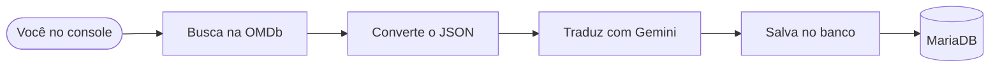

# 🎬 Screenmatch

Projeto de estudo em Java com Spring Boot. A ideia é simples: o usuário busca séries pelo console, o app consulta uma API externa, salva os dados no banco e ainda traduz a sinopse automaticamente com IA.


---

## 💡 O que esse projeto faz?

- Busca informações de séries na **API do OMDb**
- - Traduz a sinopse para português usando o **Google Gemini**
- Salva as séries e episódios no **banco de dados MariaDB**
- Tudo isso via **menu no console** — sem tela, sem botão, só texto mesmo

---

## 🔁 Como funciona na prática



---

## 🛠️ O que foi usado

| O quê | Para quê |
|---|---|
| Java 17 | Linguagem do projeto |
| Spring Boot 4.0.5 | Base do projeto |
| Spring Data JPA | Salvar e buscar dados no banco |
| MariaDB | Banco de dados |
| Jackson | Ler o JSON que vem da API |
| Google GenAI | Traduzir sinopses com IA |
| Maven | Gerenciar as dependências |

---

## 📋 O que dá pra fazer no menu

1. Buscar uma série pelo nome
2. Buscar episódios de uma série
3. Listar todas as séries salvas
4. Buscar série por título (no banco)
5. Buscar séries por nome de ator
6. Ver o Top 5 séries por avaliação
7. Buscar séries por gênero
8. Filtrar séries por temporadas e avaliação
9. Buscar episódios por trecho do título
10. Ver os melhores episódios de uma série
11. Buscar episódios por ano de lançamento

---

## 📁 Estrutura do projeto

```
screenmatch/
├── model/          → as entidades: Serie, Episodio, Categoria...
├── Principal/      → o menu e a lógica principal
├── repository/     → consultas ao banco
├── service/        → consumo de API e tradução com Gemini
├── resources/
│   └── application.properties
├── .env            ← suas chaves (não sobe pro Git!)
└── pom.xml
```

---

## ⚙️ Configurando o ambiente

O projeto usa variáveis de ambiente para não expor senhas e chaves de API no código. Você precisa definir estas 5 variáveis:

| Variável | O que é |
|---|---|
| `DB_URL` | Endereço do banco de dados |
| `DB_USER` | Usuário do banco |
| `DB_PASSWORD` | Senha do banco |
| `OMDB_API_KEY` | Chave da API OMDb |
| `GEMINI_API_KEY` | Chave da API Google Gemini |

### Como configurar no IntelliJ

Vá em `Run > Edit Configurations > Environment Variables` e adicione cada variável no formato `NOME=valor`.

## ⚠️ Pontos de melhoria

Este é um projeto de estudo, então algumas coisas foram feitas de forma simples de propósito.

Isso tudo pode (e deve!) ser melhorado conforme o aprendizado avança. 🚀

---

*Projeto desenvolvido para fins de estudo.*